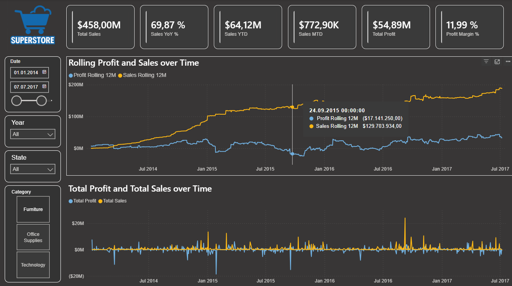
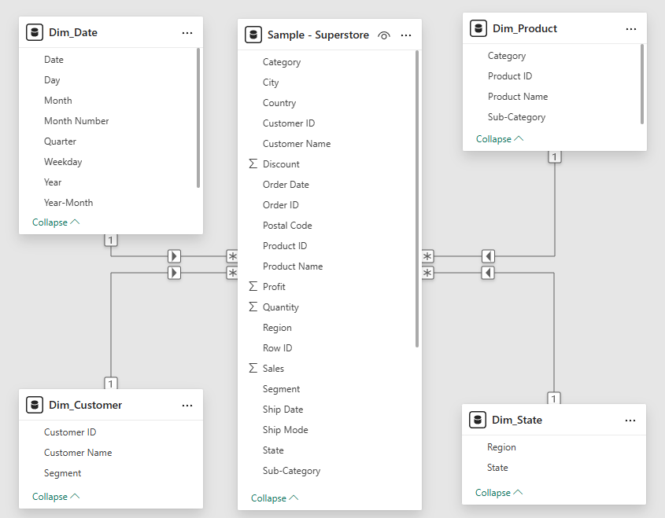

# Retail Sales & Profit Insights — Power BI Dashboard

Repository: `powerbi-superstore-sales-insights`  
Author: Jakob Schwartz  
Tools: Power BI, Power Query, DAX, Star Schema, Time Intelligence

---

## 1. Overview

This project is a complete end-to-end Power BI solution built on the popular **Superstore** retail dataset.  
It demonstrates:

- Professional data cleaning in Power Query  
- A clean **Star Schema** dimensional model  
- Custom DAX measures including **Time Intelligence**  
- KPI cards, trend visuals, slicers, and page layout design  
- Business-focused insights on sales, profitability, and performance trends  

The dashboard highlights:

- **Total Sales**
- **Total Profit**
- **Profit Margin %**
- **YoY %**
- **Rolling 12-Month Trends**
- **Category, State & Date slicers**

---

## 2. Final Dashboard (Page 1)

### 📊 Executive Overview  
Fully formatted dark mode dashboard with KPI cards, date/category/state slicers, and two trend visuals.

---

## 3. Data Model (Star Schema)

A fully normalized star schema was created for clean modeling and accurate Time Intelligence.

### Dimension Tables
- **Dim_Date**
- **Dim_Customer**
- **Dim_Product**
- **Dim_State**
- **Dim_Geography**

### Fact Table
- **Fact_Orders**

### Relationships
- Customer ID → Dim_Customer  
- Product ID → Dim_Product  
- Order Date → Dim_Date  
- State → Dim_State  
- Region/City → Dim_Geography  

**Dim_Date** is marked as the official Date Table.

---

## 4. DAX Measures

### Base Measures
- `Total Sales`
- `Total Profit`
- `Profit Margin %`

### Time Intelligence Measures
- `Sales YTD`
- `Sales MTD`
- `Sales YoY`
- `Sales YoY %`
- `Sales Rolling 12M`
- `Profit Rolling 12M`
- `Profit YoY`

These measures power the trend visualization and KPI cards.

---

## 5. Dashboard Structure

### Page 1 — Executive Overview  
Contains:

- KPI cards (Sales, Profit, Margin, YoY %, YTD, MTD)
- Sales Rolling 12M vs Total Sales
- Profit Rolling 12M vs Total Profit
- Fully formatted axes, legends, colors, and layout
- Slicers: Date, Year, State, Category

More pages (Product performance, Segments, Profit Drivers) are planned for future expansion.

---

## 6. Folder Structure
powerbi-superstore-sales-insights/
│
├── data/ # Superstore CSV dataset
├── pbix/ # Power BI dashboard file
├── docs/ # Project logs & documentation
├── assets/ # Screenshots for README
└── README.md # Project documentation

---

## 7. Status

**✔ Page 1 complete — fully formatted & ready for portfolio**  
**Next steps:**

- Add Page 2 (Product Performance)
- Add Page 3 (Customer & Segment Insights)
- Add Product Profitability KPIs
- Prepare short insight text for GitHub & LinkedIn post

---

